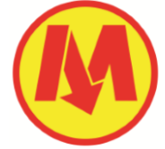
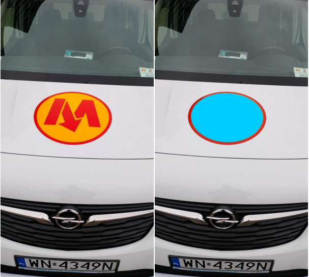
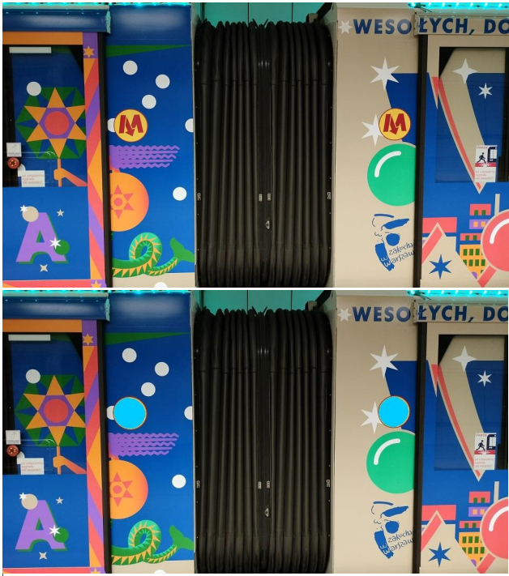

# Logo Recognition
### Autor: Paweł Martyniuk
Celem projektu było zaprojektowanie oraz implementacja aplikacji służącej do rozpoznawania loga
Metra Warszawskiego. 

Na przedstawionym obrazie można zauważyć, że logo składa się z żółtego tła, czerwonego obwodu
oraz wewnątrz 3 osobnych kształtów układających się w literę ‘M’.

Program został napisany w języku C++ z wykorzystaniem bibiloteki OpenCV.

## Wyniki

